# embedded-3dgfx

[](https://crates.io/crates/embedded-3dgfx)
[](https://docs.rs/embedded-3dgfx)
[](https://github.com/leftger/embedded-3dgfx/actions/workflows/ci.yml)
[](LICENSE-MIT)

A `no_std` 3D graphics and physics engine for embedded systems, optimized for resource-constrained devices. Features real-time rendering, rigid body dynamics, soft body physics, skeletal animation, and visual effects.

> This is a fork of [embedded-gfx](https://github.com/Kezii/embedded-gfx) by [Kezii](https://github.com/Kezii). This fork adds texture mapping, fog/dithering effects, DMA rendering, Z-buffer improvements, anti-aliasing, a complete physics engine, and Quake-style environmental effects.

## What's new in 0.4.0

- **Breaking:** `fixed_math.rs` and `lut.rs` were removed. Q16.16 fixed-point arithmetic and the sin/cos lookup table now live in [`embedded-dsp`](https://crates.io/crates/embedded-dsp)'s `fixed-point`/`lut` modules (identical algorithms, ported verbatim, now shared with `embedded-gui` instead of duplicated).
  - `Q16`, `to_q16`, `from_q16`, `ScanlineInterp`, and friends are now only exported when the `fixed-transform` feature is enabled (previously unconditional). `fixed-transform` now implies `dsp`.
  - The legacy `to_fp`/`from_fp`/`mul_fp`/`div_fp` aliases are gone — use the canonical `to_q16`/`from_q16`/`mul_q16`/`div_q16` names instead.
  - No rendering behavior change — verified bit-identical output against the prior implementation.

## What's new in 0.3.2

- **Object-Level 6-Plane Frustum Culling** — Upgraded bounding sphere culling to perform full camera frustum side-plane checks using the Gribb-Hartmann method. Completely skips off-screen meshes before they reach the projection phase, yielding a 50-90% reduction in geometry overhead.
- **Upfront Pre-Transformed Vertex Buffer (Vertex Cache)** — Projects and lights unique vertices once per mesh into a flat stack buffer upfront. Completely eliminates lazy caching branch overhead and redundant transformation/projection calculations.
- **Hardware Acceleration: DMA2D / Chrom-ART** — Added the `dma2d` feature gate. Allows clearing depth buffers via hardware-accelerated DMA2D controller hooks, letting target applications offload 16-bit depth fills to silicon and free up CPU cycles.
- **Agnostic Async Double/Triple Buffering** — Added `core::future::Future` compatibility to Double and Triple Swapchain present operations (`present_async`, `present_region_async`, `wait_for_vsync_async`), permitting seamless integration with async runtimes such as RTOS or Embassy without pinning requirements.

## What's new in 0.3.0

- **Perspective-correct textures** — clip-space W is propagated through the rasterizer; UV coordinates are now divided by W per pixel, eliminating the affine swim on non-axis-aligned surfaces
- **Sector lighting** — Doom-style per-sector brightness scaling applied at mesh level, zero per-vertex cost
- **UV ray-casting** — `mesh_ray_cast` now returns barycentric-interpolated UV at the hit point alongside distance, world position, and face normal
- **HUD overlay** — `hud` module provides a fixed-capacity overlay for text and icon elements drawn after the scene pass
- **record/execute pipeline** (introduced in 0.2, stabilized in 0.3) — scene traversal and rasterization are explicit separate phases; command buffers can be replayed without re-traversing the scene graph

## Recent additions

- **Textured meshes via record/execute** — `RenderMode::Textured` + `K3dengine::execute_with_textures` let the normal mesh pipeline draw texture-mapped triangles (previously `execute()` silently dropped them; textures required bypassing `record`/`execute` entirely). Textured and flat-colored/lit meshes can be recorded together in one `record()` call. See `examples/mesh_texture_demo.rs`.
- **Particle system** — fixed-capacity, no-alloc billboard emitter (`ParticleSystem<N>`). Supports color and size interpolation over particle lifetime, gravity/acceleration, and camera-facing billboards. Integrates with the record/execute pipeline via `sys.record(&engine, &mut cmd_buf)`.
- **Runtime depth fog** — `K3dengine::set_fog(FogConfig)` enables per-pixel linear depth fog applied during rasterization across both mesh and BSP paths.
- **Dynamic point lights** — `K3dengine::add_point_light(PointLight)` registers runtime point lights with squared-distance falloff that are composited as an additive RGB565 tint on top of baked/directional lighting at face granularity.
- **BSP room-strip builder (std)** — `bsp::builder::build_room_strip` converts high-level room specs into valid BSP lumps for quick tooling/tests/examples.

## Features

**3D Rendering**
- Full MVP pipeline with perspective projection, Gribb-Hartmann 6-plane frustum culling, and backface culling
- Z-buffering with 16.16 fixed-point depth testing
- Flat and Gouraud shading, directional lighting, Blinn-Phong specular
- Perspective-correct UV texture mapping with multi-texture support (RGB565)
- Sector lighting (Doom-style per-mesh brightness scaling)
- Runtime depth fog (`K3dengine::set_fog`)
- Dynamic point lights with additive tint (`K3dengine::add_point_light`)
- Particle system — no-alloc billboard emitters with color/size over lifetime (`ParticleSystem<N>`)
- Bayer 4×4 dithering, billboards, vertex animation
- Anti-aliased lines and triangles (heuristic and per-pixel coverage modes)
- LOD system with distance-based mesh switching
- DMA double/triple-buffer rendering via `swapchain` (with async/await executor-agnostic futures)
- HUD overlay with text and icon elements

**Record/Execute Pipeline**
- `engine.record(meshes, &mut cmd_buf, telemetry)` — traverse scene graph, emit draw commands
- `engine.execute(fb, &mut frame, &cmd_buf, telemetry)` — rasterize commands to framebuffer
- `engine.execute_tiled(...)` — tile-binned execution for partial display updates

**Physics Engine** *(feature: `physics`, opt-in)*
- Rigid body dynamics — linear/angular motion, forces, torques
- Sphere, AABB, and capsule colliders with impulse-based collision response
- Distance, ball-socket, and fixed joint constraints
- Ray casting with hit point, face normal, and UV coordinate

**Skeletal Animation**
- Parent-child bone hierarchies with linear blend skinning (LBS/SSD)
- Up to 4 bone influences per vertex

**Soft Body Physics** *(feature: `physics`, opt-in)*
- Mass-spring systems for cloth, jelly, and deformable objects
- Volume preservation via pressure simulation

**UI Animation**
- Rigid transform animation tracks for splash screens and menus
- Tweening with easing functions (`Tween3`, `Easing`)

## Screenshots

<table>
  <tr>
    <td align="center">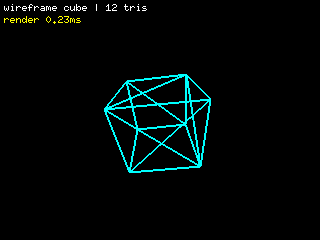<br><em>Wireframe rendering</em></td>
    <td align="center">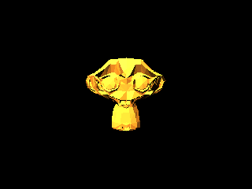<br><em>Blinn-Phong shading (Suzanne)</em></td>
  </tr>
  <tr>
    <td align="center">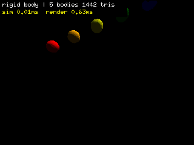<br><em>Rigid body physics</em></td>
    <td align="center">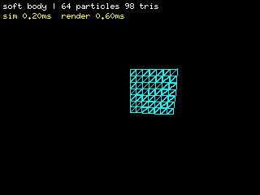<br><em>Cloth soft-body simulation</em></td>
  </tr>
  <tr>
    <td align="center">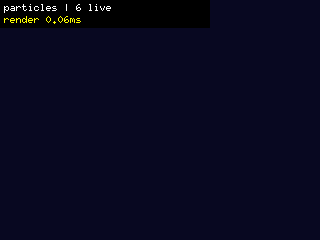<br><em>Particle system + depth fog</em></td>
    <td align="center">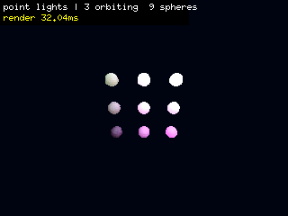<br><em>Dynamic point lights (orbiting)</em></td>
  </tr>
  <tr>
    <td colspan="2" align="center">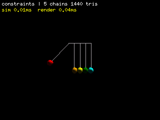<br><em>Newton's cradle (distance constraints)</em></td>
  </tr>
</table>

<table>
  <tr>
    <td align="center">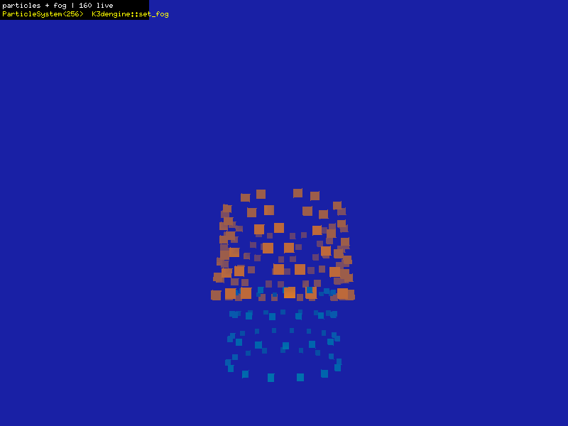<br><em>Particle fountain + depth fog</em></td>
    <td align="center">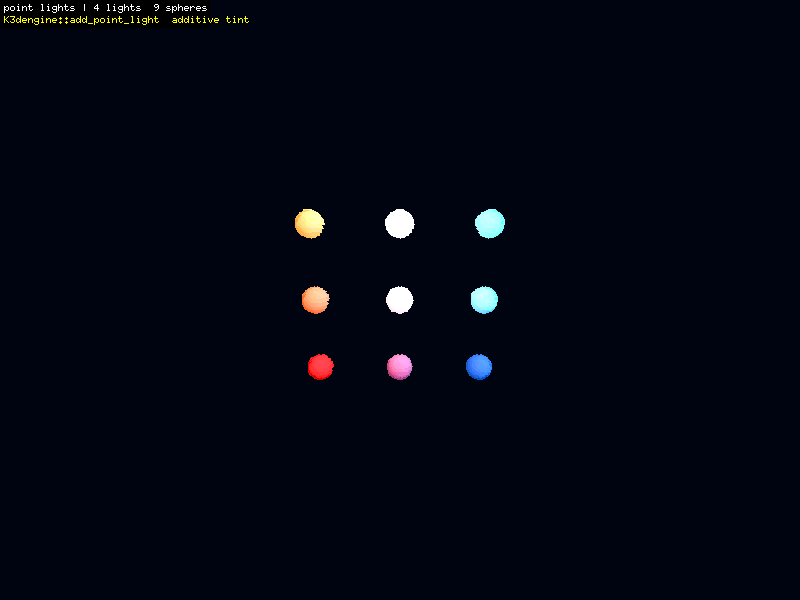<br><em>Point lights — additive tint</em></td>
  </tr>
  <tr>
    <td align="center">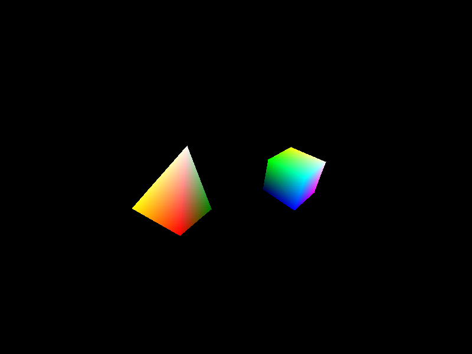<br><em>Gouraud shading (per-vertex color)</em></td>
    <td align="center">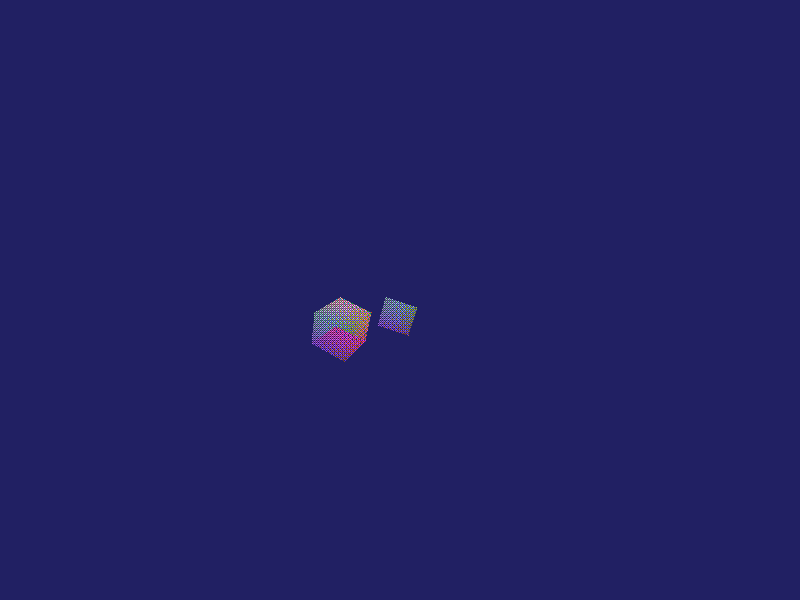<br><em>Fog + Bayer dithering</em></td>
  </tr>
  <tr>
    <td align="center">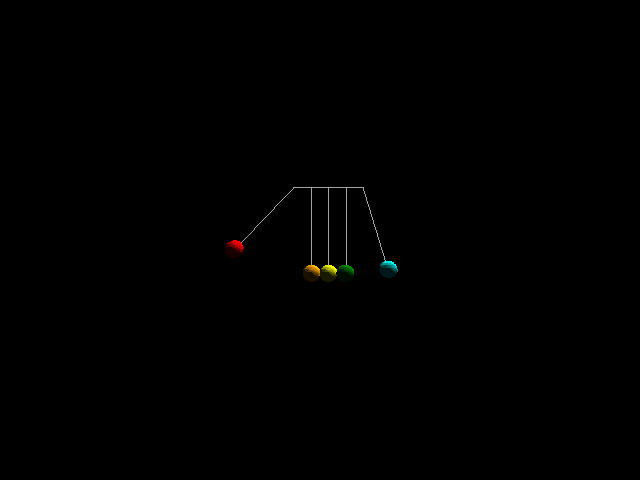<br><em>Newton's cradle (constraints)</em></td>
    <td align="center">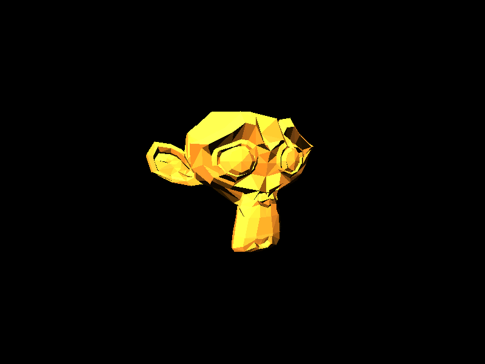<br><em>Blinn-Phong specular</em></td>
  </tr>
  <tr>
    <td align="center">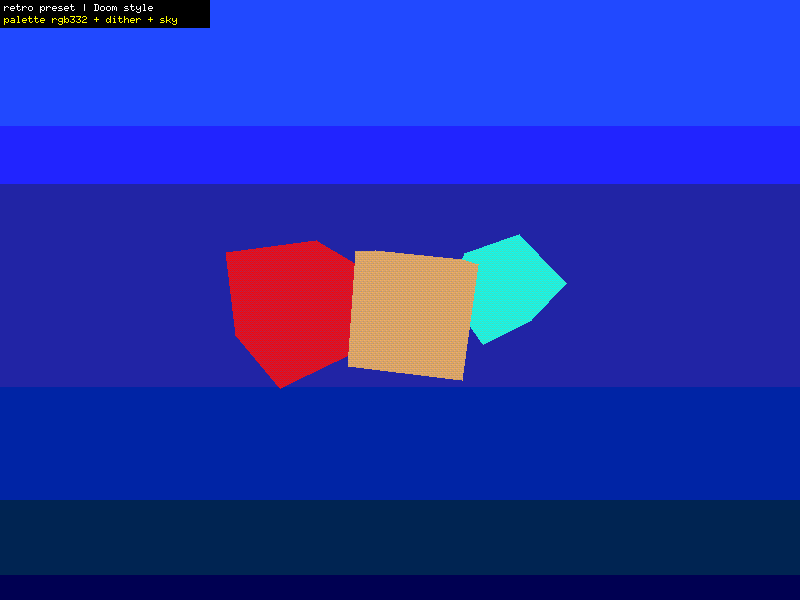<br><em>Retro preset (Doom-style)</em></td>
    <td align="center">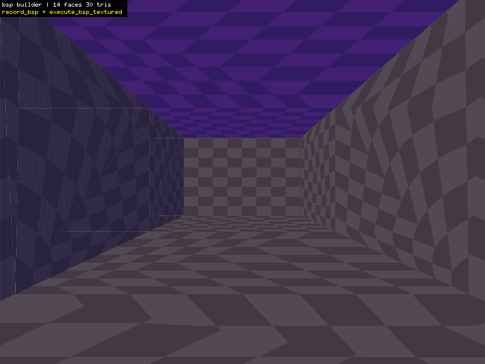<br><em>BSP room-strip builder + textured BSP path</em></td>
  </tr>
</table>

To regenerate all screenshots and GIFs:

```bash
cargo run --example screenshots --features std
```

## Installation

```toml
[dependencies]
# Embedded (no_std)
embedded-3dgfx = { version = "0.4", default-features = false }

# With physics
embedded-3dgfx = { version = "0.4", features = ["physics"] }

# Desktop / simulator with all features
embedded-3dgfx = { version = "0.4", features = ["std", "physics"] }
```

## Basic Example

```rust
use embedded_3dgfx::{K3dengine, mesh::{Geometry, K3dMesh, RenderMode}};
use nalgebra::Vector3;

let mut engine = K3dengine::new(320, 240);
engine.camera.set_position(Vector3::new(0.0, 0.0, 5.0).into());

let geometry = Geometry { vertices: &CUBE_VERTS, faces: &CUBE_FACES, /* ... */ };
let mut mesh = K3dMesh::new(geometry);
mesh.set_render_mode(RenderMode::Lines);

// Record draw commands, then rasterize to framebuffer
let mut commands = embedded_3dgfx::command_buffer::CommandBuffer::<512>::new();
engine.record(core::iter::once(&mesh), &mut commands, None).unwrap();
engine.execute(&mut display, &mut frame_ctx, &commands, None).unwrap();
```

## Particle System

```rust
use embedded_3dgfx::particles::{ParticleSpawn, ParticleSystem};
use nalgebra::{Point3, Vector3};

// Fixed capacity — no heap allocation
let mut sys: ParticleSystem<256> = ParticleSystem::new();

// Spawn a burst of sparks from the origin
sys.spawn(ParticleSpawn {
    position: Point3::new(0.0, 0.0, 0.0),
    velocity: Vector3::new(0.5, 3.0, 0.3),
    acceleration: Vector3::zeros(),
    color_start: Rgb565::new(31, 60, 10), // yellow-white
    color_end:   Rgb565::new(28, 5, 0),   // orange-red
    size_start: 0.2,
    size_end:   0.0,
    lifetime:   1.5,
});

// Per-frame: integrate physics, then append billboard quads to the command buffer
let gravity = Vector3::new(0.0, -4.0, 0.0);
sys.update(dt, gravity);
sys.record(&engine, &mut commands);
// engine.execute(...) renders particles alongside meshes
```

## Dynamic Point Lights

```rust
use embedded_3dgfx::lights::PointLight;
use nalgebra::Point3;

let mut engine = K3dengine::new(320, 240);

// Register up to MAX_POINT_LIGHTS per frame
engine.add_point_light(
    PointLight::new(
        Point3::new(-3.0, 2.0, 1.0), // world position
        Rgb565::new(31, 0, 0),        // red light
        8.0,                          // radius
    )
    .with_intensity(1.2),
);

// Lights are automatically applied during engine.record()
// as additive RGB565 tint at face granularity — no extra draw pass needed.
engine.record(meshes.iter(), &mut commands, None).unwrap();

// Clear each frame to update light positions
engine.clear_point_lights();
```

## Depth Fog

```rust
use embedded_3dgfx::draw::FogConfig;

let fog_color = Rgb565::new(4, 8, 12); // dark blue haze
engine.set_fog(FogConfig::new(fog_color, 5.0, 28.0)); // near, far

// Fog is applied per-pixel during rasterization across all render modes.
// Clear the display to the fog color so distant surfaces blend seamlessly:
display.clear(fog_color).unwrap();

engine.record(meshes.iter(), &mut commands, None).unwrap();
engine.execute(&mut display, &mut frame_ctx, &commands, None).unwrap();

// Disable fog
engine.clear_fog();
```

## Physics Example

```rust
use embedded_3dgfx::physics::{PhysicsWorld, RigidBody, Collider, Ray};
use nalgebra::Vector3;

let mut world = PhysicsWorld::<16, 4>::new();
world.set_gravity(Vector3::new(0.0, -9.81, 0.0));

// Dynamic sphere
let sphere_id = world.add_body(
    RigidBody::new(1.0)
        .with_collider(Collider::Sphere { radius: 0.5 })
        .with_position(Vector3::new(0.0, 10.0, 0.0))
        .with_restitution(0.7)
        .with_inertia_sphere(0.5),
).unwrap();

// Static floor
world.add_body(
    RigidBody::new_static()
        .with_collider(Collider::Aabb { half_extents: Vector3::new(10.0, 0.5, 10.0) })
        .with_friction(0.6),
).unwrap();

// Advance simulation (8 constraint-solver iterations)
world.step::<8>(0.016);

// UV-aware ray cast
let ray = Ray::new(Vector3::zeros(), Vector3::new(0.0, -1.0, 0.0));
if let Some(hit) = world.ray_cast(&ray, 100.0) {
    // hit.distance, hit.point, hit.normal, hit.uv
}
```

## Skeletal Animation

```rust
use embedded_3dgfx::skeleton::{Skeleton, Bone, SkinningData, VertexSkinning, apply_skinning};
use nalgebra::Vector3;

let mut skeleton = Skeleton::<8>::new();
let root = skeleton.add_bone(Bone::new("root"), None).unwrap();
let arm  = skeleton.add_bone(
    Bone::new("arm").with_position(Vector3::new(0.0, 1.0, 0.0)),
    Some(root),
).unwrap();

skeleton.update_transforms();
skeleton.compute_inverse_bind_poses();

let mut skinning = SkinningData::new();
skinning.add_vertex(VertexSkinning::two_bones(root.0, 0.7, arm.0, 0.3)).unwrap();

// Animate, then deform mesh
skeleton.get_bone_mut(arm).unwrap().set_rotation(rotation);
skeleton.update_transforms();
apply_skinning(&skeleton, &skinning, &bind_vertices, &mut deformed_vertices);
```

## Soft Body

```rust
use embedded_3dgfx::softbody::SoftBody;

// Pre-built cloth pinned at the top edge
let mut cloth = SoftBody::<64, 256>::create_cloth(8, 6, 0.2, 100.0, 0.5).unwrap();
cloth.set_gravity(nalgebra::Vector3::new(0.0, -9.81, 0.0));
cloth.ground_plane = Some(0.0);

cloth.step(0.016);

let mut positions = [[0.0f32; 3]; 64];
cloth.get_vertex_positions(&mut positions);
```

Available pre-built shapes: `create_cloth`, `create_jelly_cube`, `create_soft_sphere`.

## Examples

31 interactive examples — run any with:

```bash
cargo run --example <name> --features std
```

**Rendering**
| Example | Description |
|---------|-------------|
| `basic_rendering` | Render mode cycling: points, lines, solid |
| `rotating_cube` | Animated 3D transformations |
| `scene_viewer` | Interactive multi-mesh scene |
| `lighting_demo` | Directional lighting with ambient |
| `gouraud_demo` | Smooth per-vertex color interpolation |
| `blinn_phong_demo` | Specular highlights |
| `fog_dithering_demo` | Atmospheric fog + Bayer dithering |
| `texture_mapping_demo` | Perspective-correct UV textures |
| `retro_presets_demo` | Toggle Doom/PSX/Modern retro rendering presets |
| `bsp_builder_demo` | Runtime BSP room-strip building + textured BSP render |
| `dma_rendering_demo` | Double-buffer DMA performance |
| `billboard_demo` | Camera-facing quads |
| `lod_demo` | Distance-based mesh LOD switching |
| `vertex_animation_demo` | Keyframe vertex morphing |
| `painters_algorithm_demo` | Painter's algorithm ordering |
| `boot_menu` | Boot splash + menu transitions (96×64, tweens) |
| `stl_viewer` | Load and view STL models |

**Physics** *(requires `physics` feature)*
| Example | Description |
|---------|-------------|
| `physics_rolling_ball` | Beginner intro — gravity, friction, ramps |
| `physics_bouncing_balls` | Restitution coefficients compared |
| `physics_pendulum` | Constraint-based swinging |
| `physics_newtons_cradle` | Momentum conservation via distance constraints |
| `physics_stack_tower` | Stacking stability with friction |
| `physics_domino_chain` | Chain-reaction angular dynamics |
| `physics_wrecking_ball` | Heavy ball vs light boxes |
| `physics_demo` | Comprehensive physics showcase |
| `capsule_physics_demo` | Capsule collider interactions |
| `skeletal_animation_demo` | Bone hierarchy and linear blend skinning |
| `cloth_simulation` | Hanging cloth with wind |
| `jelly_cube_demo` | Deformable cube with volume preservation |
| `raycast_demo` | Ray casting, hit detection, UV lookup |

## Physics Reference

### Creating bodies

```rust
// Dynamic body
let id = physics.add_body(
    RigidBody::new(mass)
        .with_position(Vector3::new(x, y, z))
        .with_velocity(Vector3::new(vx, vy, vz))
        .with_collider(Collider::Sphere { radius })
        .with_restitution(0.5)
        .with_friction(0.5)
        .with_inertia_sphere(radius),
).unwrap();

// Static body (floor, wall)
physics.add_body(
    RigidBody::new_static()
        .with_position(Vector3::new(0.0, 0.0, 0.0))
        .with_collider(Collider::Aabb { half_extents: Vector3::new(10.0, 0.1, 10.0) })
        .with_friction(0.6),
).unwrap();
```

### Distance constraints

```rust
physics.add_distance_constraint(
    anchor_id,
    Vector3::zeros(), // anchor attachment point
    body_id,
    Vector3::zeros(), // body attachment point
    0.0,              // compliance (0.0 = rigid)
).unwrap();
```

### Stepping and sync

```rust
// Step with 8 constraint-solver iterations
physics.step::<8>(1.0 / 60.0);

// Sync physics state to render meshes
for &id in &body_ids {
    let body = physics.body(id).unwrap();
    sync_body_to_mesh(body, &mut mesh);
}
```

### Capacity

```rust
PhysicsWorld::<16, 8>::new()  // 16 bodies, 8 constraints (const generics, no heap)
```

## DMA / Async Double Buffering (RTOS/Embassy)

Double-buffered rendering via `SwapChain` separates CPU rendering and DMA transfers. While the CPU writes to the back-buffer, the display controller transmits the front-buffer asynchronously.

To support asynchronous environments (`no_std` executors, RTOS tasks, Embassy, RTIC, etc.), `embedded-3dgfx` provides **Agnostic / Standard Futures** APIs. Because they return standard `core::future::Future`s, they require no runtime/executor dependencies.

### Usage Example

To present a buffer asynchronously inside an async task:

```rust
use embedded_3dgfx::swapchain::StandardSwapChain;

#[embassy_executor::task]
async fn render_task(mut swap_chain: StandardSwapChain<240, 135, MyDisplayBackend>) {
    let mut cmd_buf = embedded_3dgfx::command_buffer::CommandBuffer::<512>::new();

    loop {
        // 1. Get the back buffer and render the scene
        let back_buf = swap_chain.get_back_buffer();
        engine.record(meshes.iter(), &mut cmd_buf, None).unwrap();
        engine.execute(back_buf, &mut frame_ctx, &cmd_buf, None).unwrap();

        // 2. Swap framebuffers asynchronously.
        // Awaiting yields control back to the executor if a previous DMA transfer is in progress.
        // Once the transfer finishes, it swaps front/back and triggers the next DMA transfer.
        swap_chain.present_async().await.unwrap();
    }
}
```

To implement async DMA support for your display controller, implement [AsyncDmaTransfer](file:///home/usuario/Projects/my-repos/embedded-3dgfx/src/display_backend.rs) on your backend transfer token:

```rust
use embedded_3dgfx::display_backend::{DmaTransfer, AsyncDmaTransfer};

pub struct MyDmaTransfer {
    // hardware-specific DMA handle / buffer
}

impl DmaTransfer for MyDmaTransfer {
    type Buffer = MyFrameBuffer;
    fn is_done(&self) -> bool {
        // Poll DMA register flags
    }
    fn wait(self) -> Self::Buffer {
        // Blocking wait
    }
}

impl AsyncDmaTransfer for MyDmaTransfer {
    type WaitFuture = MyDmaWaitFuture;

    fn wait_async(self) -> Self::WaitFuture {
        MyDmaWaitFuture { transfer: Some(self) }
    }
}

// A standard Future that registers a waker or polls the DMA status
impl core::future::Future for MyDmaWaitFuture {
    type Output = MyFrameBuffer;
    fn poll(mut self: Pin<&mut Self>, cx: &mut Context<'_>) -> Poll<Self::Output> {
        // Poll status; if not done, register cx.waker().clone() for the DMA interrupt to wake
    }
}
```

### Troubleshooting

| Symptom | Fix |
|---------|-----|
| Bodies fall through floor | Increase solver iterations; check collider types match |
| Constraints are stretchy | Increase solver iterations; set compliance to 0.0 |
| Simulation explodes | Reduce timestep; add damping; verify inertia tensors |
| Poor performance | Reduce max contacts; fewer substeps; prefer sphere colliders |

## Feature Flags

| Flag | Default | Description |
|------|---------|-------------|
| `physics` | off | Rigid body dynamics, soft body, and ray casting (`physics` + `softbody` modules) |
| `std` | on | Enables painter's algorithm (`Vec`) and includes `perfcounter` |
| `perfcounter` | off | FPS/timing measurements (requires `std` or `embassy-time`) |
| `embassy-time` | off | Timing source for embedded targets |
| `aa-heuristic` | on | Heuristic edge AA for triangles, no extra buffer |
| `aa-coverage` | on | Per-pixel coverage AA; eliminates shared-edge seam at cost of a W×H byte buffer |
| `row_width_96` | — | Optimize row buffers for 96 px wide displays |
| `row_width_160` | — | Optimize row buffers for 160 px wide displays |
| `row_width_240` | — | Optimize row buffers for 240 px wide displays (default) |
| `row_width_320` | — | Optimize row buffers for 320 px wide displays |
| `dsp` | off | Pulls in [`embedded-dsp`](https://crates.io/crates/embedded-dsp) for shared numerics (currently: quaternion normalization in `skeleton.rs`) |
| `fixed-transform` | off | Fixed-point screen-space projection path. Implies `dsp` — Q16.16 arithmetic lives in `embedded-dsp`'s `fixed-point` feature (shared with `embedded-gui`) rather than a copy in this crate |
| `dwt-profiler` | off | DWT cycle-counter profiling hooks |
| `triple-buffering` | off | Triple-buffered swapchain APIs |

`row_width_*` flags are mutually exclusive. `aa` is an internal flag enabled automatically by either AA feature.

## Caps and Telemetry

Technical reference docs in `docs/`:

| Doc | Topic |
|-----|-------|
| `caps-and-telemetry.md` | Record/execute pipeline, profile caps, telemetry API, CI budget enforcement |
| `backend-integration.md` | Board bring-up checklist, memory sizing, hardware profiling, smoke tests, compatibility matrix |
| `asset-pipeline.md` | Offline converter CLI, chunked scene format, cooperative streaming loader, CI budget reporting |

## System Requirements

**Minimum:**
- ARM Cortex-M4F with FPU
- 128 KB RAM (single buffer, small scenes)
- 256 KB Flash

**Recommended:**
- ARM Cortex-M33 with FPU (e.g. STM32WBA)
- 512 KB+ RAM (double buffer + Z-buffer + physics)
- 512 KB+ Flash

**Memory at 240×135:**

| Feature | Cost |
|---------|------|
| Single framebuffer | 65 KB |
| Double framebuffer | 130 KB |
| Z-buffer | 130 KB |
| Physics (16 bodies) | ~4 KB |
| Soft body (64 particles) | ~2 KB |
| Skeleton (8 bones) | ~1 KB |
| Particle system (256 particles) | ~6 KB |
| Point light set (8 lights) | <1 KB |

**Budget at 240×135 @ 60 FPS:**
- Rendering: ~10–13 ms/frame
- Physics (16 bodies): ~2–3 ms/frame
- DMA display transfer: ~3 ms (parallel)

## Performance

Desktop benchmarks at 320×240 (`cargo run --release --example screenshots --features std`):

| Scene | Triangles | p50 release | p50 debug |
|-------|-----------|-------------|-----------|
| Wireframe cube | 12 | **0.05 ms** | 3.6 ms |
| Blinn-Phong Suzanne | ~960 | **0.09 ms** | 6.6 ms |
| Physics (5 balls + floor) + render | ~800 | **0.08 ms** | 8.2 ms |

Desktop figures are on a modern x86-64 CPU. On ARM Cortex-M33 @ 64 MHz expect roughly 10–13 ms/frame for mid-complexity scenes at 240×135.

Key optimizations in the record/execute pipeline:
- **micromath transcendentals** — `sin`/`cos`/`atan2` routed through [micromath](https://crates.io/crates/micromath) on `no_std`, replacing soft-float libm; ~15–25% reduction in per-frame transform cost on Cortex-M4
- **16.16 fixed-point z-buffer** — depth values stored as `u32`, cutting memory bandwidth on 32-bit bus targets
- **Separate record/execute phases** — command-buffer replay avoids re-traversing the scene graph on unchanged frames

## Architecture

```
src/
  lib.rs              # Engine entry point: K3dengine, record/execute API
  camera.rs           # View/projection matrices
  mesh.rs             # Geometry, LOD, render modes
  draw.rs             # Rasterization, shading, fog, effects
  renderer.rs         # FrameCtx, execute_commands, tiled execution
  command_buffer.rs   # Fixed-capacity command buffer
  particles.rs        # No-alloc billboard particle system
  lights.rs           # Dynamic point lights, PointLight, PointLightSet
  sector_lights.rs    # Doom-style per-sector brightness scaling
  config.rs           # ProfileCaps, QualityTier, DegradationPolicy
  error.rs            # RenderError, BudgetKind
  physics.rs          # Rigid body dynamics (feature: physics)
  character.rs        # Character controller
  skeleton.rs         # Skeletal animation, linear blend skinning
  softbody.rs         # Mass-spring soft body physics (feature: physics)
  texture.rs          # Texture management, RGB565
  billboard.rs        # Camera-facing quads
  animation.rs        # Keyframe vertex animation
  transform_anim.rs   # Rigid transform animation tracks
  tween.rs            # Tweening and easing functions
  swapchain.rs        # DMA double/triple buffering
  display_backend.rs  # Display abstraction layer
  bridge.rs           # embedded-graphics bridge
  input.rs            # Input event handling
  painters.rs         # Painter's algorithm (std only)
  retro.rs            # Retro rendering presets (Doom/PSX-style)
  hud.rs              # HUD overlay elements
  scene_format.rs     # Serialized scene chunk format
  scene_stream.rs     # Cooperative chunk streaming
  hardware_profile.rs # Target hardware profile definitions
  perfcounter.rs      # FPS/timing measurements
  telemetry.rs        # Record/execute telemetry types
  tilebin.rs          # Tile-bin stats and config
  bsp/                # BSP tree builder, PVS, and traversal (Doom-style levels)

load_stl/             # STL file embedding macro
examples/             # 31 interactive demos
tests/                # 320 library unit tests + integration/regression suites (~400 total)
```

Q16.16 fixed-point math (`fixed-transform` feature) and the sin/cos lookup table formerly in this crate's own `fixed_math.rs`/`lut.rs` now live in [`embedded-dsp`](https://crates.io/crates/embedded-dsp), shared with `embedded-gui`; see the `dsp`/`fixed-transform` rows in [Feature Flags](#feature-flags).

## Testing

```bash
cargo test --lib
cargo test --lib --features dma2d,depth-u16
```

## Git Hooks (Rustfmt Guardrails)

Versioned hooks live in `.githooks/` and can be installed into `.git/hooks`:

```bash
./scripts/install-git-hooks.sh
```

Installed behavior:
- `pre-commit`: runs `cargo fmt --all` and re-stages formatted staged Rust files.
- `pre-push`: runs `cargo fmt --all --check` and blocks push on formatting drift.

## Contributing

Contributions welcome. Priority areas:
- Hardware-specific display backends (ESP32, STM32, RP2040)
- Spatial partitioning (octree/BVH for broad-phase collision)
- Additional joint types (hinge, slider, prismatic)
- Mesh colliders (convex hulls)

## References

**Graphics:**
- [Tricks of the 3D Game Programming Gurus](https://www.amazon.com/Tricks-Game-Programming-Gurus-Advanced/dp/0672318350)
- [Michael Abrash's Graphics Programming Black Book](https://github.com/jagregory/abrash-black-book)
- [PSX Graphics Programming](https://psx-spx.consoledev.net/graphicsprocessingunitgpu/)

**Physics:**
- [Game Physics Engine Development](https://www.routledge.com/Game-Physics-Engine-Development/Millington/p/book/9780123819765)
- [Real-Time Collision Detection](https://www.amazon.com/Real-Time-Collision-Detection-Interactive-Technology/dp/1558607323)

## License

The contents of this repository are dual-licensed under the _MIT OR Apache 2.0_
License. That means you can choose either the MIT license or the Apache 2.0
license when you re-use this code. See [`LICENSE-MIT`](./LICENSE-MIT) or
[`LICENSE-APACHE`](./LICENSE-APACHE) for more information on each specific
license. Our Apache 2.0 notices can be found in [`NOTICE`](./NOTICE).
