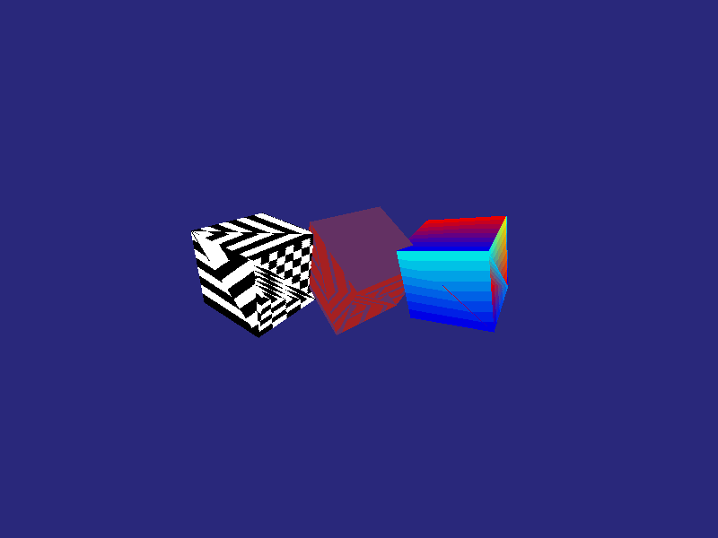

# embedded-3dgfx

[](https://crates.io/crates/embedded-3dgfx)
[](https://github.com/leftger/embedded-3dgfx/actions)

A `no_std` 3D graphics and physics engine for embedded systems, optimized for resource-constrained devices. Features real-time rendering, rigid body dynamics, soft body physics, skeletal animation, and visual effects.

> This is a fork of [embedded-gfx](https://github.com/Kezii/embedded-gfx) by [Kezii](https://github.com/Kezii). This fork adds texture mapping, fog/dithering effects, DMA rendering, Z-buffer improvements, anti-aliasing, and a complete physics engine.

## Features

**3D Rendering**
- Full MVP pipeline — Model-View-Projection with perspective projection
- Z-buffering with 16.16 fixed-point depth testing
- Flat and Gouraud shading, directional lighting, Blinn-Phong specular
- Affine UV texture mapping with multi-texture support and RGB565 format
- Fog, dithering (4x4 Bayer), billboards, vertex animation
- Anti-aliased lines and triangles (heuristic and per-pixel coverage modes)
- LOD system with distance-based mesh switching
- Frustum and backface culling, DMA double-buffer rendering

**Physics Engine**
- Rigid body dynamics — linear/angular motion, forces, torques
- Sphere, AABB, and capsule colliders with impulse-based collision response
- Distance, ball-socket, and fixed joint constraints
- Ray casting with hit point and normal

**Skeletal Animation**
- Parent-child bone hierarchies with linear blend skinning (SSD)
- Up to 4 bone influences per vertex

**Soft Body Physics**
- Mass-spring systems for cloth, jelly, and deformable objects
- Volume preservation via pressure simulation

**UI Animation**
- Rigid transform animation tracks for splash screens and menus
- Tweening with easing functions (`Tween3`, `Easing`)

## Screenshots

<table>
  <tr>
    <td align="center"><br><em>Wireframe rendering</em></td>
    <td align="center"><br><em>Blinn-Phong shading (Suzanne)</em></td>
  </tr>
  <tr>
    <td align="center"><br><em>Rigid body physics</em></td>
    <td align="center"><br><em>Cloth soft-body simulation</em></td>
  </tr>
</table>

<table>
  <tr>
    <td align="center"><br><em>Gouraud shading (per-vertex color)</em></td>
    <td align="center"><br><em>Fog + Bayer dithering</em></td>
  </tr>
  <tr>
    <td align="center"><br><em>Newton's cradle (constraints)</em></td>
    <td align="center"><br><em>UV texture mapping</em></td>
  </tr>
</table>

To regenerate all screenshots and GIFs:

```bash
cargo run --example screenshots --features std
```

## Installation

```toml
[dependencies]
# Embedded (no_std)
embedded-3dgfx = { version = "0.2", default-features = false }

# Desktop / simulator with all features
embedded-3dgfx = { version = "0.2", features = ["std"] }
```

## Basic Example

```rust
use embedded_3dgfx::{K3dengine, mesh::{Geometry, K3dMesh, RenderMode}};
use nalgebra::Vector3;

let mut engine = K3dengine::new(320, 240);
engine.camera.set_position(Vector3::new(0.0, 0.0, 5.0).into());

let geometry = Geometry { vertices: &CUBE_VERTS, faces: &CUBE_FACES, /* ... */ };
let mut mesh = K3dMesh::new(geometry);
mesh.set_render_mode(RenderMode::Lines);

engine.render(std::iter::once(&mesh), |primitive| {
    draw(primitive, &mut display);
});
```

## Physics Example

```rust
use embedded_3dgfx::physics::{PhysicsWorld, RigidBody, Collider, Ray};
use nalgebra::Vector3;

let mut world = PhysicsWorld::<16, 4>::new();
world.set_gravity(Vector3::new(0.0, -9.81, 0.0));

let sphere = RigidBody::new(1.0)
    .with_collider(Collider::Sphere { radius: 0.5 })
    .with_position(Vector3::new(0.0, 10.0, 0.0));
world.add_body(sphere);

let ground = RigidBody::new_static()
    .with_collider(Collider::Aabb { half_extents: Vector3::new(10.0, 0.5, 10.0) });
world.add_body(ground);

world.step::<8>(0.016);

let ray = Ray::new(Vector3::zeros(), Vector3::new(0.0, -1.0, 0.0));
if let Some(hit) = world.ray_cast(&ray, 100.0) {
    println!("Hit at distance: {}", hit.distance);
}
```

## Examples

The project includes 26 interactive examples. Run with:

```bash
cargo run --example <name> --features std
```

**Rendering:**
- `basic_rendering` — render mode cycling (points, lines, solid)
- `rotating_cube` — animated 3D transformations
- `scene_viewer` — interactive multi-mesh scene
- `lighting_demo` — directional lighting with ambient
- `gouraud_demo` — smooth color interpolation
- `blinn_phong_demo` — specular highlights
- `fog_dithering_demo` — atmospheric effects
- `texture_mapping_demo` — UV-mapped textures
- `dma_rendering_demo` — double-buffer performance
- `billboard_demo` — camera-facing quads
- `lod_demo` — level-of-detail switching
- `vertex_animation_demo` — keyframe vertex morphing
- `painters_algorithm_demo` — painter's algorithm rendering
- `boot_menu` — boot splash and menu transitions (96x64, tweens + transform tracks)
- `stl_viewer` — load and view STL models

**Physics:**
- `physics_rolling_ball` — beginner-friendly intro
- `physics_bouncing_balls` — multiple colliding spheres
- `physics_pendulum` — swinging pendulum with constraints
- `physics_newtons_cradle` — chain constraints
- `physics_stack_tower` — stacking boxes with friction
- `physics_domino_chain` — domino effect simulation
- `physics_wrecking_ball` — wrecking ball demolition
- `physics_demo` — comprehensive physics showcase
- `capsule_physics_demo` — capsule collider interactions
- `skeletal_animation_demo` — bone hierarchy and skinning
- `cloth_simulation` — hanging cloth with wind
- `jelly_cube_demo` — soft deformable cube
- `raycast_demo` — ray casting and hit detection

## Feature Flags

| Flag | Default | Description |
|------|---------|-------------|
| `std` | on | Enables painter's algorithm (`Vec`) and includes `perfcounter` |
| `perfcounter` | off | FPS/timing measurements (requires `std` or `embassy-time`) |
| `embassy-time` | off | Timing source for embedded targets |
| `aa-heuristic` | on | Heuristic analytical edge anti-aliasing for triangles, no extra buffer |
| `aa-coverage` | on | Per-pixel coverage AA with end-of-frame composite; eliminates shared-edge seam at cost of a W×H byte buffer |
| `row_width_96` | — | Optimize row buffers for 96px-wide displays |
| `row_width_160` | — | Optimize row buffers for 160px-wide displays |
| `row_width_240` | — | Optimize row buffers for 240px-wide displays (default) |
| `row_width_320` | — | Optimize row buffers for 320px-wide displays |

The `row_width_*` flags are mutually exclusive. `aa` is an internal flag enabled automatically by either AA feature.

## System Requirements

**Minimum:**
- ARM Cortex-M4F with FPU
- 128 KB RAM (single buffer, small scenes)
- 256 KB Flash

**Recommended:**
- ARM Cortex-M33 with FPU (e.g. STM32WBA)
- 512 KB+ RAM (double buffer + Z-buffer + physics)
- 512 KB+ Flash

**Memory usage at 240x135:**

| Feature | Cost |
|---------|------|
| Single framebuffer | 65 KB |
| Double framebuffer | 130 KB |
| Z-buffer | 130 KB |
| Physics (16 bodies) | ~4 KB |
| Soft body (64 particles) | ~2 KB |
| Skeleton (8 bones) | ~1 KB |

**Performance budget at 240x135 @ 60 FPS:**
- Rendering: ~10-13 ms/frame
- Physics (16 bodies): ~2-3 ms/frame
- DMA display transfer: ~3 ms (parallel)

## Architecture

```
src/
  lib.rs              # Main engine and rendering loop
  camera.rs           # View/projection matrices
  mesh.rs             # Geometry, LOD
  draw.rs             # Rasterization, shading, effects
  physics.rs          # Rigid body dynamics
  skeleton.rs         # Skeletal animation
  softbody.rs         # Soft body physics
  texture.rs          # Texture management
  billboard.rs        # Camera-facing quads
  animation.rs        # Keyframe animation
  transform_anim.rs   # Rigid transform animation tracks
  tween.rs            # Tweening and easing
  swapchain.rs        # DMA double-buffering
  display_backend.rs  # Display abstraction
  bridge.rs           # embedded-graphics bridge
  painters.rs         # Painter's algorithm
  perfcounter.rs      # Performance monitoring
  lut.rs              # Lookup tables

load_stl/             # STL file embedding macro
examples/             # 26 interactive demos
tests/                # 196 unit tests
```

## Testing

```bash
cargo test --lib
cargo test --lib --all-features
```

## Contributing

Contributions welcome. Priority areas:
- Hardware-specific display backends (ESP32, STM32, RP2040)
- Spatial partitioning (octree/BVH for broad-phase)
- Additional joint types (hinge, slider, prismatic)
- Perspective-correct texture mapping
- Mesh colliders (convex hulls)

## References

**Graphics:**
- [Tricks of the 3D Game Programming Gurus](https://www.amazon.com/Tricks-Game-Programming-Gurus-Advanced/dp/0672318350)
- [Michael Abrash's Graphics Programming Black Book](https://github.com/jagregory/abrash-black-book)
- [PSX Graphics Programming](https://psx-spx.consoledev.net/graphicsprocessingunitgpu/)

**Physics:**
- [Game Physics Engine Development](https://www.routledge.com/Game-Physics-Engine-Development/Millington/p/book/9780123819765)
- [Real-Time Collision Detection](https://www.amazon.com/Real-Time-Collision-Detection-Interactive-Technology/dp/1558607323)

## License

MIT OR Apache-2.0 — see LICENSE for details.
